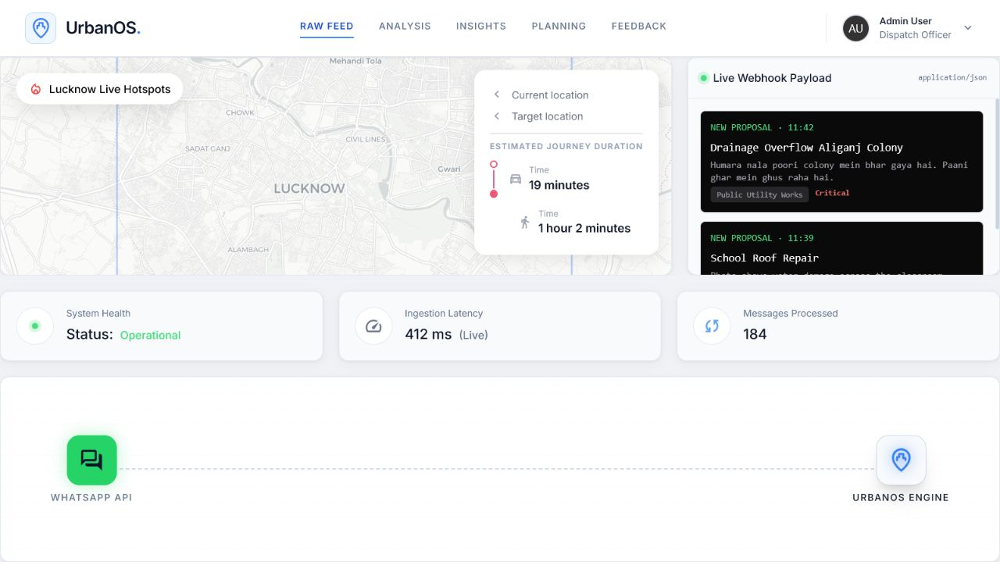
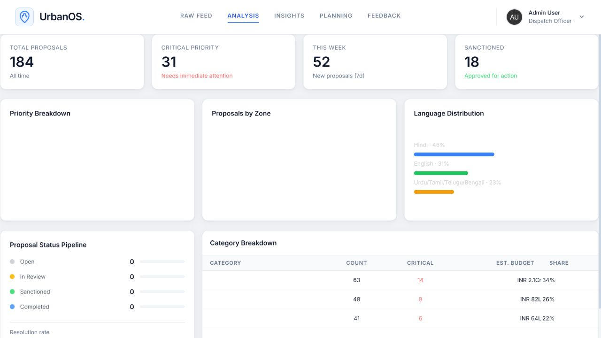
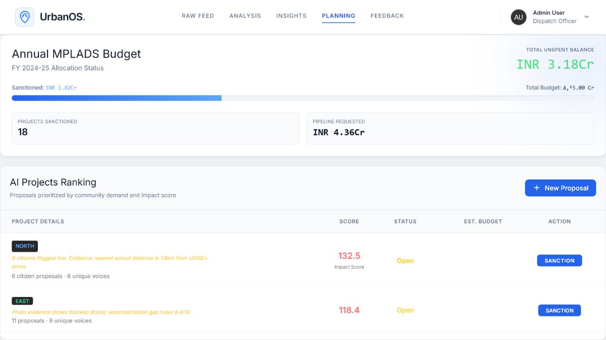
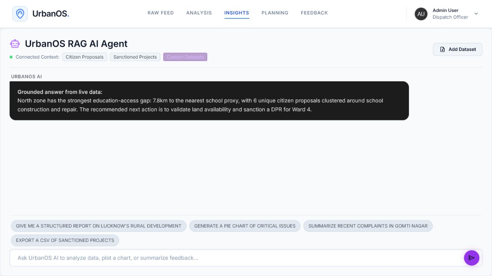
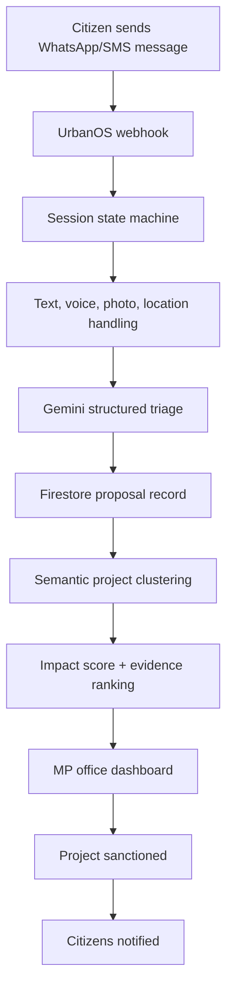

# UrbanOS

**The AI layer between a citizen's voice and an MP's development decision.**

[Live demo](https://urbanos.web.app) · Firebase + FastAPI · Gemini multimodal triage · WhatsApp/SMS intake · Firestore realtime dashboard

---

## The Monday Morning Problem

An MP's office does not receive development priorities in a clean spreadsheet.

It receives them as WhatsApp forwards from booth workers, voice notes from villages, letters from gram panchayats, public meeting notes, photos of broken drains, Facebook posts, and calls from local representatives. By the time the office has to decide what to sanction this quarter, there may be forty competing demands:

- repair a school roof,
- build a vocational training centre,
- clear a drainage line,
- install streetlights,
- upgrade a health sub-centre,
- repair a road that keeps flooding.

The problem is not that citizens do not speak. The problem is that their voices arrive in formats the office cannot compare.

UrbanOS turns that messy public input into a ranked, evidence-backed planning queue.

---

## What We Built

UrbanOS is a working civic planning prototype for constituency development.

Citizens submit proposals through WhatsApp or SMS using text, voice, photo, or location pins. Gemini converts each submission into structured civic data: category, priority, summary, zone, budget estimate, language, semantic cluster, and visual evidence when a photo is attached. The dashboard then groups similar proposals, weighs citizen demand against infrastructure gaps, recommends projects for sanction, and closes the loop by notifying citizens when action is taken.

The core idea is simple:

> Do not ask citizens to learn a new government portal. Meet them where they already complain, explain, and organize.

---

## Screenshots

### Live Intake
Incoming citizen reports appear as a live webhook feed, with location and system telemetry visible to the MP office.



### Analysis
The dashboard tracks proposal volume, criticality, language distribution, and sector-level demand.



### AI Planning Queue
Projects are ranked by citizen demand, urgency, budget, and category-specific deprivation signals.



### Insights Agent
The AI assistant answers questions only from connected UrbanOS data: proposals, sanctions, surveys, and uploaded datasets.



---

## Why This Is Different

Most civic tools stop at grievance collection. UrbanOS is built around planning.

**We do not only store complaints.** We cluster them into projects an MP can act on.

**We do not only count votes.** We weigh demand against deprivation. Ten requests for a school in an area where children travel 7.8 km should beat fifteen requests for a park in an already-served zone.

**We do not only display dashboards.** The sanction button closes the citizen feedback loop by sending WhatsApp notifications to the people who raised the issue.

**We do not force one input format.** A citizen can type, speak, send a photo, or share a GPS pin. SMS fallback exists for low-connectivity cases.

---

## Product Flow



---

## The AI Work

UrbanOS uses Gemini for three real jobs:

1. **Structured civic triage**  
   The model returns schema-constrained JSON, not loose prose. Each proposal gets a category, priority, estimated budget, zone, short summary, language, and semantic tag.

2. **Multimodal evidence extraction**  
   If a citizen attaches a photo, the backend fetches the Twilio media securely and sends the image bytes to Gemini. The stored record includes `visual_evidence`, such as visible flooding, broken pavement, or roof damage.

3. **Grounded insights agent**  
   The dashboard chat builds its context from live Firestore proposals, sanctions, uploaded datasets, and aggregate counts. Legacy canned demo responses have been removed; if Gemini quota is exhausted, the endpoint returns a graceful data summary instead of crashing.

---

## Ranking Formula

The ranking engine groups proposals by `(semantic_tag, zone)`.

```text
Impact Score = demand_count * priority_score * (1 + category_gap / 10)
```

The important detail is `category_gap`. It is not one generic number.

UrbanOS chooses the deprivation signal based on the project type:

| Project type | Evidence signal |
|---|---|
| School / classroom | nearest school distance |
| Clinic / PHC / health | nearest health facility distance |
| Road / bridge / signal | road-connectivity gap index |
| Water / drain / sewer | water-sanitation gap index |
| Power / streetlights | utility gap index |
| Park / waste / flooding | environment/public-space gap index |

This makes the ranking easier to defend in front of citizens, officials, and auditors.

---

## Things Judges Might Miss

- **The sanction button is cluster-safe.** It updates only the exact semantic project cluster, not every proposal in the same broad category.
- **The dashboard has real Firebase Auth.** Admin access uses Google sign-in and can be restricted with an `ADMIN_EMAILS` allowlist.
- **The Twilio webhook validates signatures** when `TWILIO_AUTH_TOKEN` is configured.
- **Voice notes are asynchronous.** The webhook replies quickly, then the worker transcribes audio and continues the session.
- **The AI chat degrades gracefully.** Gemini quota/rate-limit errors return useful live aggregate context instead of a 500.
- **The repo is submission-clean.** Virtualenv, local DB files, Firebase cache, and generated bytecode are ignored/untracked.

---

## Tech Stack

| Layer | Choice | Why |
|---|---|---|
| Citizen intake | Twilio WhatsApp + SMS | No new app, low friction, familiar behavior |
| AI | Gemini 2.5 Flash Lite | Fast multimodal triage and structured JSON |
| Backend | FastAPI on Python 3.11 | Async-friendly API with simple deployment |
| Database | Cloud Firestore | Realtime dashboard and flexible civic records |
| Hosting | Firebase Hosting + Cloud Functions | Works for a constituency office without server ops |
| Frontend | Vanilla JS + Tailwind CDN | No build step, easy hackathon deploy |
| Maps | Leaflet + OpenStreetMap | Free map layer, no paid map API required |

---

## Run Locally

```bash
python -m venv venv
venv\Scripts\activate
pip install -r requirements.txt
cp .env.example .env
uvicorn main:app --reload
```

Then open:

```text
http://127.0.0.1:8000
```

For WhatsApp testing:

```bash
ngrok http 8000
```

Set the Twilio webhook to:

```text
https://<ngrok-url>/webhook/whatsapp
```

Optional SMS fallback:

```text
https://<ngrok-url>/webhook/sms
```

---

## Environment Variables

```env
GEMINI_API_KEY=your_gemini_api_key
TWILIO_ACCOUNT_SID=your_twilio_sid
TWILIO_AUTH_TOKEN=your_twilio_auth_token
TWILIO_WHATSAPP_NUMBER=whatsapp:+14155238886
FIREBASE_API_KEY=your_firebase_web_api_key
ADMIN_EMAILS=mp-office@example.com,aide@example.com
```

Do not commit `.env` or `firebase-key.json`.

---

## Deploy

```bash
firebase login
firebase use urbanos101
firebase deploy
```

Production dashboard:

```text
https://urbanos.web.app
```

Production WhatsApp webhook:

```text
https://api-<cloud-function-hash>-uc.a.run.app/webhook/whatsapp
```

---

## Limitations

This is a hackathon prototype, so we are explicit about what is real and what still needs production hardening.

- **Twilio Sandbox:** the demo can run through Twilio Sandbox; production needs a verified WhatsApp Business number.
- **Infrastructure data:** current gap metrics are constituency-zone proxy layers, not live government API pulls.
- **AI confidence:** Gemini triage should be human-reviewable before sanctions in production.
- **Privacy:** phone numbers are stored as senders today; production should hash/anonymize citizen identifiers where possible.
- **Scale:** Firestore scans are acceptable for the prototype but should move to precomputed aggregates/queues at district scale.
- **Offline inclusion:** SMS fallback exists; IVR/USSD is the next step for citizens without WhatsApp or literacy comfort.

---

## Future Roadmap

1. **Multi-constituency tenancy**  
   One deployment serving multiple MPs, each with isolated data and role-based permissions.

2. **Evidence-grade datasets**  
   Replace static proxy layers with live UDISE+, NHM, Census, ward boundary, public works, and budget datasets.

3. **Human-in-the-loop triage**  
   Let aides approve or correct AI category, budget, priority, and clustering before ranking.

4. **IVR and public-meeting import**  
   Add voice-call intake and a fast aide-entry mode for public meetings.

5. **Public transparency page**  
   Publish non-sensitive sanctioned projects, status, budget, and expected completion date.

6. **Audit and anti-gaming controls**  
   Deduplicate coordinated spam, detect repeated submissions, and log every administrative action.

---

## The Bigger Picture

India has 543 Lok Sabha constituencies. Each MP office hears from people every day, but the signal is trapped inside informal channels.

UrbanOS does not replace the MP, the aide, or the public meeting.

It gives the office a defensible listening layer: one that can say, with evidence, "this is what people are asking for, this is where the need is highest, this is what we acted on, and these are the citizens we informed when it moved."

That feedback loop is the product.
